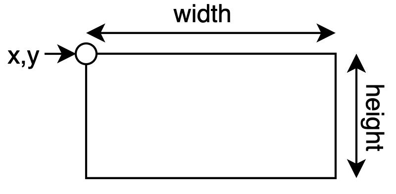
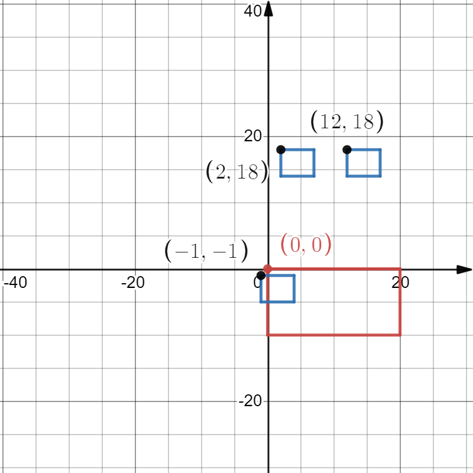
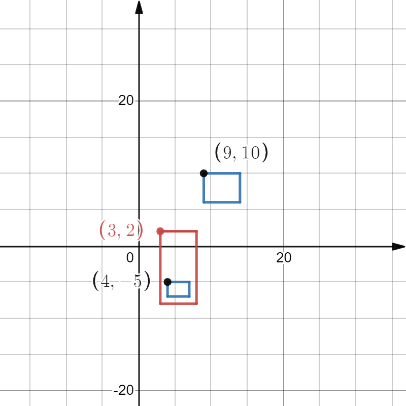

# Filtering Service
This service is a simple API, in each POST request it takes a main rectangle and some other rectangles. It stores a list of rectangles that are overlaping with the main rectangle. In each GET request, it will return the list of all saved rectangles that were overlaping with theier main rectangle.
### Rectangle Definition
A rectangle is specified with four elements; (x, y, width, height). It is interpreted as the following:
<br>

<br>
### Storage
Since the desired output has a type of `list`, so I use python object serialization (pickle) as memory.

### Request and Input Examples
Here I specify some examples and desired response:
```
POST http://127.0.0.1:5000/ (2021-12-06 01:47:55)
ex1 = {
            "main": {"x": 0, "y": 0, "width": 10, "height": 20},
            "input": [
                    {"x": 2, "y": 18, "width": 5, "height": 4},
                    {"x": 12, "y": 18, "width": 5, "height": 4},
                    {"x": -1, "y": -1, "width": 5, "height": 4}
            ]
}
```
The rectangles for this request will be like:
<br>

<br>
So `{ "x":-1, "y":-1, "width":5, "height":4, "time":"2021-12-06 01:47:55" }` will be stored.
```
POST http://127.0.0.1:5000/ (2021-12-06 03:38:13)
ex2 = {
            "main": {"x": 3, "y": 2, "width": 5, "height": 10},
            "input": [
                    {"x": 4, "y": -5, "width": 2, "height": 2},
                    {"x": 9, "y": 10, "width": 5, "height": 4}
            ]
}
```
The rectangles for this request will be like:
<br>

<br>
So `{ "x":4, "y":-5, "width":2, "height":2, "time":"2021-12-06 03:38:13" }` will be stored.

### Response Example
If we call get on the same endpoint, we will get the following response on previous inputs:
```
[
   {"x":-1, "y":-1, "width":5, "height":4, "time":"2021-12-06 01:47:55"},
   {"x":4, "y":-5, "width":2, "height":2, "time":"2021-12-06 03:38:13"}
]
```
### Usage
Flask is used as a web framework in this project. You can install dependencies with:

```pip install -r requirements.txt```

Then by running `python server.py`, you can use the api on localhost:5000.